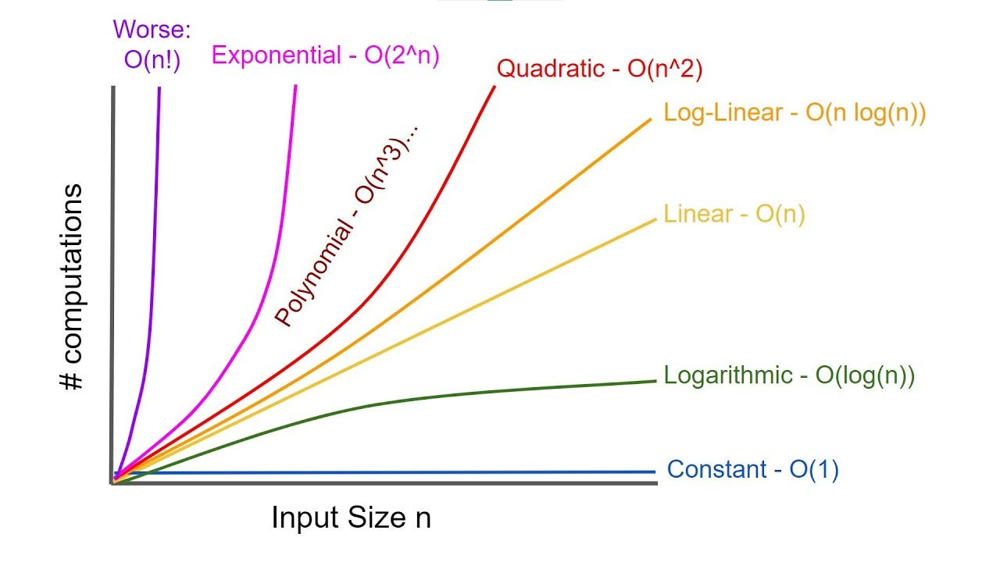

# Big O Notation

## Objectives

- Motivate the need for something like Big O Notation.
- Describe what Big O Notation is.
- Simplify Big O Expressions.
- Define "time complexity" and "space complexity".
- Evaluate the time complexity and space complexity of different algorithms using Big O Notation.
- Describe what a logarithm is.

## What's the idea here?

- Imagine we have multiple implementations of the same function.
- How can we determine which one is the **_best_**?

## Who cares ?

- It's important to have a precise vocabulary to talk about how our code performs.
- Useful for discussing trade-offs between different approaches.
- When your code slows down or crashes, identifying parts of the code that are inefficient can help us find pain points in our applications.
- Less important: it comes up in intervies!

## An Example

- Suppose we want to write a function that calculates the sum of all numbers from 1 up to (and including) some number n.

### Example 1:

```javascript
function addUpTo(n) {
  let total = 0;
  for (let i = 1; i <= n; i++) {
    total += i;
  }
  return total;
}
```

### Example 2:

```javascript
function addUpTo(n) {
  return n * (n + 1) * 2;
}
```

## What does better mean?

- Faster? (1st => More important)
- Less memory-intensive? (2nd => important)
- More readable?

## Why not use timers?

```javascript
function addUpTo(n) {
  let total = 0;
  for (let i = 1; i <= n; i++) {
    total += i;
  }

  return total;
}

var t1 = performance.now();
addUpTo(1000000);
var t2 = performance.now();
console.log(`Time Elapsed: ${(time2 - time1) / 1000} seconds.`);
```

## The problem with time

- Different machines will record different times.
- The _same_ machine will record different times!
- For fast algorithms, speed measurements may not be precise enough?

## If not time, then what?

Rather than counting _seconds_, which are so variable...

Let's count the _number_ of simple operations the computer has to perform!

## Counting Operations

```javascript
function addUpTo(n) {
  return (n * (n + 1)) / 2;
}
```

- Multiplication
- Addition
- Division

---

3 simple operations, regardless of the size of n

```javascript
function addUpTo(n) {
  let total = 0;
  for (let i = 1; i <= n; i++) {
    total += i;
  }

  return total;
}
```

- 1 assignment (let total)
- n additions (total)
- n assignments (total)

- n additions (for)
- n assignments (for)
- 1 assignment (for 1st i = 1)
- n comparisons (for <=)

## Counting is hard!

Depending on what we count, the number of operations can be as low as 2n or as high as 5n + 2

But regardless of the exact number, the number of operations grows roughly proportionally _with n_.

## Introducing... Big O

Big O notation is a way to formalize fuzzy counting.

It allows us to talk formally about how the runtime of an algorithm grows as the inputs grow.

We won't care about the details, only the trends.

We say that an algorithm is **O(f(n))** if the number of simple operations the computer has to do is eventually less than a constant times **f(n)**, as **n** increases.

- f(n) could be linear(f(n) = n)
- f(n) could be quadratic (f(n) = n<sup>2</sup>)
- f(n) could be constant (f(n) = 1)
- f(n) could be something entirely different!

## Example

```javascript
function addUpTo(n) {
  return (n * (n + 1)) / 2;
}
```

Always 3 operations: **O(1)**

---

```javascript
function addUpTo(n) {
  let total = 0;
  for (let i = 1; i <= n; i++) {
    total += i;
  }

  return total;
}
```

Number of operations is (eventually) bounded by a multiple of n (say, 10n): **O(n)**

---

```javascript
function countUpAndDown(n) {
  console.log("Going up!");
  for (let i = 0; i < n; i++) {
    console.log(i);
  }
  console.log("At the top! \n Going down...");
  for (let j = n - 1; j >= 0; j--) {
    console.log(j);
  }
  console.log("Back down. Bye!");
}
```

Each for is **O(n)** so it's **O(2n)**, but we take care of the big picture so it's **O(n)**.

---

```javascript
function printAllPairs(n) {
  for (let i = 0; i < n; i++) {
    for (let j = 0; j < n; j++) {
      console.log(i, j);
    }
  }
}
```

Each for is **O(n)** but they are nested(**O(n)** operation inside of an **O(n)** operation.), so it's **O(n)<sup>2</sup>**.

## Simplifying Big O Expressions

When determining of the time complexity of an algorithm, there are some helpful rule of thumbs for big O expressions.

These rules of thumb are consequences of the definition of big O notation.

- ### Constants Don't Matter
  - If we have **O(2n)**, we will use **O(n)**.
  - If we have **O(500)**, we will use **O(1)**.
  - If we have **O(13n<sup>2</sup>)**, we will use **O(n<sup>2</sup>)**.
- ### Smaller Terms Don't Matter
  - If we have **O(n + 10)**, we will use **O(n)**.
  - If we have **O(1000n + 50)**, we will use **O(n)**.
  - If we have **O(n<sup>2</sup> + 5n + 8)**, we will use **O(n<sup>2</sup>)**.

## Big O Shorthands

- Analyzing complexity with big O can get complicated.
- There are several rules of thumb that can help.
- These rules won't **ALWAYS** work, but are a helpful starting point.

1. Arithmetic operations are constant.
2. Variable assignment is constant.
3. Accessing elements in an array (by index) or object(by key) is constant.
4. In a loop, the complexity is the length of the loop times the complexity of whatever happens inside of the loop.

## A Couple More Examples

```javascript
function logAtLeast5(n) {
  for (let i = 1; i <= Math.max(5, n); i++) {
    console.log(i);
  }
}
```

This is **O(n)**

```javascript
function logAtMost5(n) {
  for (let i = 1; i <= Math.min(5, n); i++) {
    console.log(i);
  }
}
```

This is **O(1)**



## Space Complexity

So far, we've been focusing on **time complexity**: how can we analyze the _runtime_ of an algorithm as the size of the inputs increases?

We can also use big O notation to analize **space complexity**: how much additional memory do we need to allocate in order to run the code in our algorithm?

### What about the inputs?

Sometimes you'll hear the term **auxiliary space complexity** to refer to space required by the algorithm, not including space taken up by the inputs.

Unless otherwise noted, when we talk about space complexity, technically we'll be talking about auxiliary space complexity.

### Space Complexity in JS (Rules of Thumb)

- Most primitive (booleans, numbers, undefined, null) are constant space.
- Strings require O(n) space (where n is the string length)
- Reference types are generally O(n), where n is the length (for arrays) or the number of keys (for objects)

```javascript
function sum(arr) {
  let total = 0;
  for (let i = 0; i < arr.length; i++) {
    total += arr[i];
  }
  return total;
}
```

1. one number (equal total).
2. another number (equal for).

- Space Complexity: **O(1)**

```javascript
function double(arr) {
  let newArray = [];
  for (let i = 0; i < arr.length; i++) {
    newArr.push(2 * arr[i]);
  }
  return newArr;
}
```

1. n numbers (newArr)

- Space Complexity: **O(n)**

### Logarithms

We've encountered some of the most common complexities: O(1), O(n), O(n<sup>2</sup>).

Sometimes big O expressions involve more complex mathematical expressions.

One that appears more often than you might like is the logarithm!

#### Wait, what's a log?

log<sub>2</sub>(8) = 3 -> 2<sup>3</sup> = 8

log<sub>2</sub>(value) = exponent -> 2<sup>exponent</sup> = value

We'll omit the 2.

log === log<sub>2</sub>

The logarithm of a number roughly measures the number of times you can divide that number by 2 **before you get a value that's less than or equal to one.**

Certain searching algorithms have logarithmic time complexity.

Efficient sorting algorithms involve logarithms

Recursion sometimes involves logarithmic space complexity.
