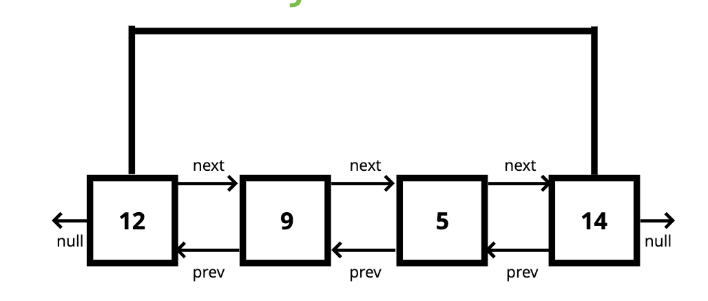

# Doubly Linked List

## Objectives

- Construct a Doubly Linked List
- Compare and contrast Doubly and Singly Linked Lists
- Implement basic operations on a Doubly Linked List

## What is a Doubly Linked List

**Almost** identical to Singly Linked Lists, except every node has **another** pointer, to the **previous** node!

## Example

## Comparison with Singly Linked Lists

Mre memory === More Flexibility

It's **almost** always a tradeoff!

## Methods

### Push

Adding a new **node** to the end of the Linked List!

#### Push Pseudocode

- Create a new node with the value passed to the function
- If the head property is null set the head and tail to be the newly created node
- If not, set the next property on the tail to be that node
- Set the previous property on the newly created node to be the tail
- Set the tail to be the newly created node
- Increment the length
- Return the Doubly Linked List

### Pop

Removing a node from the **end** of the Doubly Linked List!

#### Pop Pseudocode

- If there is not head, return undefined
- Store the current tail in a variable to return later
- If the length is 1, set the head and tail to be null
- Update the tail to be the previous Node
- set the newTail's next to null

### Shift

Removing a node from the **beginning** of the Doubly Linked List

#### Shift Pseudocode

- If length is 0, return undefined
- Store the current head property in a variable
- If the length is one:
  - set the head to be null
  - set the tail to be null
- Update the head to be the next of the old head
- Set the head's prev property to null
- Set the old head's next to null
- Decrement the length
- Return old head

### Unshift

Adding a node to the **beginning** of the Doubly Linked List

#### Unshift Pseudocode

- Create a new node with the value passed to the function
- If the length is 0
  - Set the head to be the new node
  - Set the tail to be the new node
- Otherwise
  - Set the prev property on the head of the list to be the new node
  - Set the next property on the new node to be the head property
  - Update the head to be the new node
- Increment the length
- Return the list

### Get

Accessing a node in a Doubly Linked List by it's position

#### Get Pseudocode

- If the index is less than 0 or greater or equal to the length, return null
- If the index is less than or equal to the half the length of the list
  - Loop through the list starting from the head and loop towards the middle
  - Return the node once it is found
- If the index is greater than half the length of the list
  - Loop through the list starting from the tail and loop towards the middle
  - Return the node once it is found

### Set

Replacing the value of a node in a Doubly Linked List

#### Set Pseudocode

- Create a variable which is the result of the **get** method at the index passed to the function.
  - If the **get** method returns a valid node, set the value of that node to be the value passed to the function
  - Return true
- Otherwise, return false

### Insert

Adding a node in a Doubly Linked List by a certain position

#### Insert Pseudocode

- If the index is less than zero or greater than or equal to the length return false
- If the index is 0, **unshift**
- If the index is the same as the length, **push**
- Use the **get** method to access the index - 1
- Set the next and prev properties on the correct nodes to link everything together
- Increment the length
- Return true

### Remove

removing a node in a Doubly Linked List by a certain position

### Remove Pseudocode

- If the index is less than zero or greater than or equal to the length return false
- If the index is 0, **shift**
- If the index is the same as the length - 1, **pop**
- Use the **get** method to retrieve the item to be removed
- Update the next and prev properties to remove the found node from the list
- Set next and prev to null on the found node
- Decrement the length
- Return the removed node

## Big O

### Doubly Linked List

- Insertion - **O(1)**
- Removal - **O(1)**
- Searching - **O(n)** (Technically searching is **O(n/2)**, but that's **still O(n)**)
- Access - **O(n)**

## Recap

- Doubly Linked Lists are almost identical to Singly Linked Lists except there is an additional pointer to previous nodes
- Better than Singly Linked Lists for finding nodes and can be done in half the time!
- However, they do take up more memory considering the extra pointer
