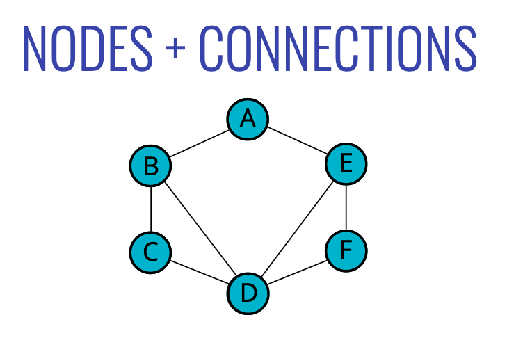
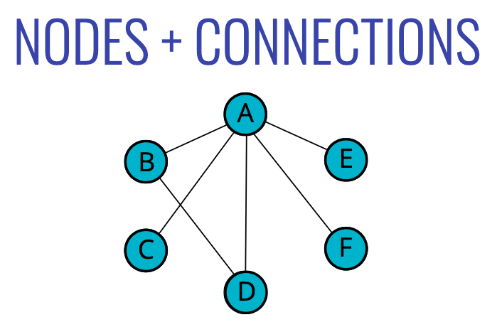
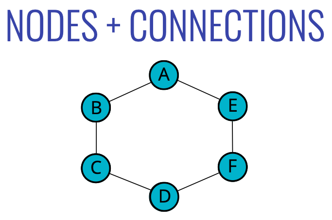
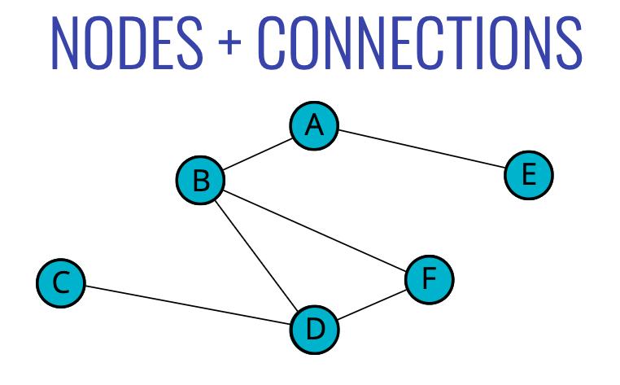

# Graph

## Objectives

- Explain what a graph is
- Compare and contrast different types of graphs and their use cases in the real world
- Implement a graph using an adjacency list
- Traverse through a graph using BFS and DFS
- Compare and contrast graph traversal algorithms

## What are Graphs

> Nodes + Connections

A **graph data structure** consists of a finite (and possibly mutable) set of vertices or nodes or points, together with a set of unordered pairs of these vertices for an undirected **graph** or a set of ordered pairs for a directed **graph**.

## Examples

<table>
<thead>
<tr>
<th>Example1</th>
<th>Example2</th>
</tr>

</thead>
<tbody>
<tr>
<td>

</td>
<td>

</td>

</tr>
</tbody>
</table>

<table>
<thead>
<tr>
<th>Example3</th>
<th>Example4</th>
</tr>
</thead>
<tbody>
<tr>
<td>

</td>
<td>

</td>
</tr>
</tbody>
</table>

## Uses for Graphs

- Social Networks
- Location / Mapping
- Routing Algorithms
- Visual Hierarchy
- File System Optimizations
- Recomendations
  - _People also watched_
  - _You might also like..._
  - _People you might know_
  - _Frequently bought with_

## Essential Graph Terms

- **vertex** - a node
- **edge** - connection between nodes
- **weighted/unweighted** - values assigned to distances between vertices
- **directed/undirected** - directions assigned to distanced between vertices

<table>
<thead>
<tr>
<th>Directed Graph</th>
<th>Undirected Graph</th>
</tr>
</thead>
<tbody>
<tr>
<td>

</td>
<td>

</td>
</tr>
</tbody>
</table>

## Adjacency Matrix

## Adjacency List

<table>
<thead>
<tr>
<th>Adjacency List 1</th>
<th>Adjacency List 2</th>
</tr>
</thead>
<tbody>
<tr>
<td>

</td>
<td>

</td>
</tr>
</tbody>
</table>

## Differences & Big O

- **|V|** - number of vertices
- **|E|** - number of edges

<table>
<thead>
<tr>
    <th>OPERATION</th>
    <th>ADJACENCY LIST</th>
    <th>ADJACENCY MATRIX</th>
</tr>
</thead>
<tbody>
<tr>
    <td>Add Vertex</td>
    <td>O(1)</td>
    <td>O(|V2|)</td>
</tr>
<tr>
    <td>Add Edge</td>
    <td>O(1)</td>
    <td>O(1)</td>
</tr>
<tr>
    <td>Remove Vertex</td>
    <td>O(|V| + |E|)</td>
    <td>O(|V2|)</td>
</tr>
<tr>
    <td>Remove Edge</td>
    <td>O(|E|)</td>
    <td>O(1)</td>
</tr>
<tr>
    <td>Query</td>
    <td>O(|V| + |E|)</td>
    <td>O(1)</td>
</tr>
<tr>
    <td>Storage</td>
    <td>O(|V| + |E|)</td>
    <td>O(|V2|)</td>
</tr>
</tbody>
</table>

<table>
<thead>
<tr>
<th>ADJACENCY LIST</th>
<th>ADJACENCY MATRIX</th>
</tr>
</thead>
<tbody>
<tr>
<td style="color:green">Can take up less space (in sparse graphs)</td>
<td style="color:red">Takes up more space (in sparse matrix)</td>
</tr>
<tr>
<td style="color:green">Faster to iterate over all edges</td>
<td style="color:red">Slower to iterate over all edges</td>
</tr>
<tr>
<td style="color:red">Can be lower to lookup specific edge</td>
<td style="color:green">Faster to lookup specific edge</td>
</tr>
</tbody>
</table>

## Methods

### Add a vertex

- Write a method called addVertex, which accepts a name of a vertex
- It should add a key to the adjacency list with the name of the vertex and set it's value to be an empty array

### Add an edge

- This function should accept two vertices, we can call them vertex1 and vertex2
- The function should find in the adjacency list the key of vertex1 and push vertex2 to the array
- The function should find in the adjacency list the key of vertex2 and push vertex1 to the array
- Don't worry about handling errors/invalid vertices

### Remove an edge

- This function should accept two vertices, we'll call them vertex1 and vertex2
- The function should reassign the key of vertex1 to be an array that does not contain vertex2
- The function should reassign the key of vertex2 to be an array that does not contain vertex1
- Don't worry about handling errors/invalid vertices

### Remove a vertex

- The function should accept a vertex to remove
- the function should loop as long as there are any other vertices in the adjacency list for that vertex
- Inside of the loop, call our **removeEdge** function with the vertex we are removing and any values in the adjacency list for that vertex
- Delete the key in the adjacency list for that vertex

## Traversing a Graph

> Visiting/Updating/Checking each vertex in a graph

- Peer to peer networking
- Web crawlers
- Finding "closest" matches/recomendations
- Shortest path problems
  - GPS Navigation
  - Solving mazes
  - AI (shortest path to win the game)

### Depth First

#### Recursive

- The function should accept a starting node
- Create a list to store the end result, to be returned at the very end
- Create an object to store visited vertices
- Create a helper function which accepts a vertex
  - The helper function should return early if the vertex is empty
  - The helper function should place the vertex it accepts into the visited object and push that vertex into the result array.
  - Loop over all of the values in the adjacencyList for that vertex
  - If any of those values have not been visited, recursively invoke the helper function with that vertex
- Invoke the helper function with the starting vertex
- Return the result array

#### Iterative

- The function should accept a starting node
- Create a stack to help use keep track of vertices (use a list/array)
- Create a list to store the end result, to be returned at the very end
- Create an object to store visited vertices
- Add the starting vertex to the stack, and mark it visited
- While the stack has something in it:
  - Pop the next vertex from the stack
  - If that vertex hasn't been visited yet:
    - Mark it as visited
    - Add it to the result list
    - Push all of it's neighbors into the stack
- Return the result array

### Breadth First

- This function should accept a starting vertex
- Create a queue (you can use an array) and place the starting vertex in it
- Create an array to store the nodes visited
- Create an object to store nodes visited
- Mark the starting vertex as visited
- Loop as long as there is anything in the queue
- Remove the first vertex from the queue and push it into the array that stores nodes visited
- Loop over each vertex in the adjacency list for the vertex you are visiting
- If it is not inside the object that stores nodes visited, mark it as visited and enqueue that vertex
- Once you have finished looping, return the array of visited nodes
