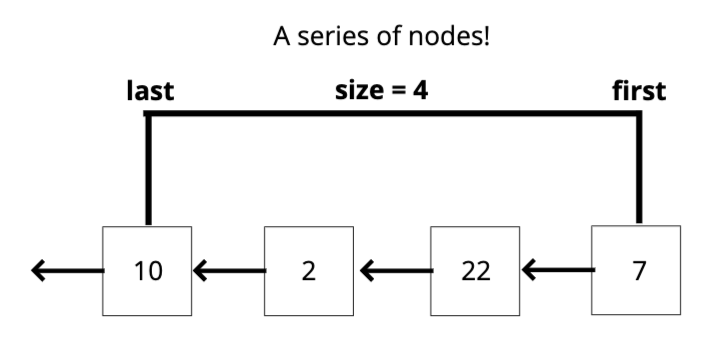

# Stack

## Objectives

- Define what a stack is
- Understand use cases for a stack
- Implement operations on a stack data structure

## What is a stack?

A **LIFO** _(**L**ast **I**nput **F**irst **O**utput)_ data structure

The last element added to the stack will be the first element removed from the stack

## How is it used?

Think about a stack of **plates**, or a stack of **markers**.

As you pile it up the last thing (or the topmost thing) is what gets removed first.

## Where stacks are used

- Managing function invocations
- Undo / Redo actions (photoshop, other programs, etc.)
- Routing (the history object) is treated like a stack!

## How you can implement it

- Array
- Simply Linked List

### Array

Using only methods:

- push (insert at last) and pop (remove last).
  - This way do not require to re-index all the array
- unshift (insert at the beggining) and shift (remove the first).
  - This particular way it's not so eficient because when you unshift or shift you have to re-index all the array

### Simply Linked List

- When you use push and pop implementation instead of using them, we should use shift and unshift implementation because pop implementation for a Stack has to be **O(1)** but the implementation for a Singly Linked List is **O(n)**

#### Push Pseudocode

- The function should accept a value
- Create a new node with that value
- If there are no nodes in the stack, set the first and last property to be the newly created node
- If there is at least one node, create a varaible that stores the current first property on the stack
- Reset the first property to be the newly created node
- Set the next property on the node to be the previously created variable
- Increment the size of the stack by 1

#### Pop Pseudocode

- If there are no nodes in the stack, return null
- Create a temporary variable to store the first property on the stack
- If there is only 1 node, set the first and last property to be null
- If there is more than one node, set the first property to be the next property on the current first
- Decrement the size by 1
- Return the value of the node removed

## Big O

### Stack - Singly Linked List

- Insertion - **O(1)**
- Removal - **O(1)**
- Searching - **O(n)**
- Access - **O(n)**

## Recap

- Stacks are a **LIFO** data structure where the last value in is always the first one out.
- Stacks are used to handle function invocations (the call stack), for operations like undo/redo, and for routing (remember pages you have visited and go back/forward) and much more!
- They are not a built in data structure in JavaScript, but are relatively simple to implement
