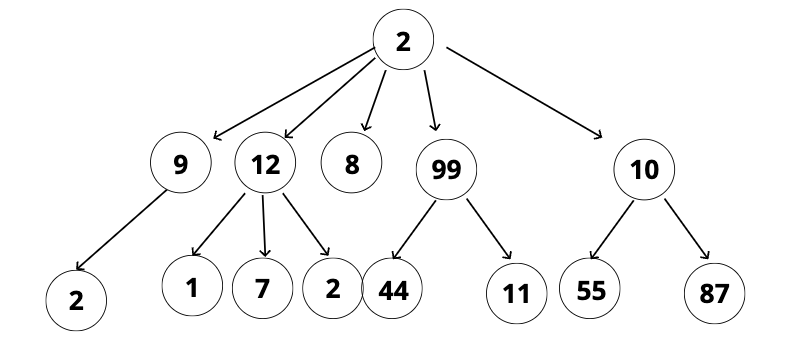

# Tree

## Objectives

- Define what a tree is
- Compare and contrast trees and lists
- Explain the differences between trees, binary trees, and binary search trees
- Implement operations on binary search trees

## What is a tree?

A data structure that consists of nodes in a **parent / child** relationship.

**_WHAT IS NOT A TREE_** A node can point to a children, not a sibling

## Example

## Compare & Contrast

- List - linear
- Tree - nonlinear

## Terminology

- **Root** - The top node in a tree.
- **Child** - A node directly connected to another node when moving away from the Root.
- **Parent** - The converse notion of a child.
- **Siblings** - A group of nodes with the same parent.
- **Leaf** - A node with no children.
- **Edge** - The connection between one node and another.

## Different use cases

- HTML DOM
- Network Routing
- Abstract Syntax Trees
- Artificial Intelligence
- Fodlers in Operating Systems
- Computer File System
- JSON

## Kinds of trees

- Trees
- Binary Trees (Per node they can only have 0, 1 or 2 children)
- Binary Search Trees (Sorted in a particular way)

### How _BSTS_ Work

- Every parent node has at most **two** children
- Every node to the left of a parent node is **always less** than the parent
- Every node to the right of a parent node is **always greater** than the parent

## Methods

### Inserting Pseudocode

- Create a new node
- Starting at the root
  - Check if there is a root, if not - the root now becomes that new node
  - If there is a root, check if the value of the new node is greater than or less than the value of the root
  - If it is greater
    - Check to see if there is a node to the right
      - If there is, move to that node and repeat these steps
      - If there is not, add that node as the right property
  - If it is less
    - Check to see if there is a node to the left
      - If there is, move to that node and repeat these steps
      - If there is not, add that node as the left property

### Finding Pseudocode

- Starting at the root
  - Check if there is a root, if not - we're done searching
  - If there is a root, check if the value of the new node is the value we are looking for. If we found it, we're done
  - If not, check to see if the value is greater than or less than the value of the root
  - If it is greater
    - Check to see if there is a node to the right
      - If there is, move to that node and repeat these steps
      - If there is not, we're done searching
  - If it is less
    - Check to see if there is a node to the left
      - If there is, move to that node and repeat these steps
      - If there is not, we're done searching

## Big O

### BST

- Insertion - **O(log n)**
  - worst case - **O(n)**
- Searching - **O(log n)**
