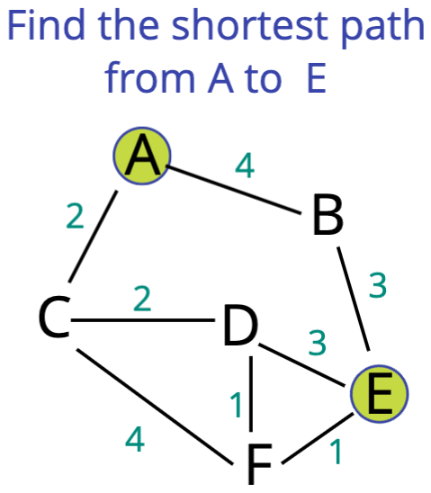

# Dijkstra's Algorithm

## Objectives

- Understand the importance of _Dijkstra's_
- Implement a Weighted Graph
- Walk through the steps of _Dijkstra's_
- Implement _Dijkstra's_ using a naive priority queue
- Implement _Dijkstra's_ using a binary heap priority queue

## What is it

One of the most famous and widely used algorithms around

Finds the shortest path between two vertices on a graph

_What's the fastest way to get from point A to point B?_

## Who was he?

_Edsger Dijkstra_ was a Dutch programmer, physicist, essayist, and all around smarty-pants

He helped to advance the field of computer science from an "art" to an academic discipline

Many of his discoveries and algorithms are still commonly used to this day

## Why is it useful?

- GPS - finding fastest route
- Network Routing - finds open shortest path for data
- Biology - used to model the spread of viruses among humans
- Airline tickets - finding cheapest route to your destination

## Dijkstra's Algorithm

1. Every time we look to visit a new node, we pick the node with the smallest known distance to visit first.
2. Once we've moved to the node we're going to visit, we look at each of it's neighbors
3. For each neighboring node, we calculate the distance by summing the total edges that lead to the node we're checking _from the starting node_.
4. If the new total distance to a node is less than the previous total, we store the new shorter distance for that node.

## Example Images

Pictures of an example are on folder `./Dijkstra's Example Steps`

## Pseudocode

- This function should accept a starting and ending vertex
- Create an object (we'll call it distances) and set each key to be every vertex in the adjacency list with a value of infinity, except for the starting vertex which should have a value of 0
- After setting a value in the distance object, add each vertex with a priority of Infinity to the priority queue, except the starting vertex, which should have a priority of 0 because that's where we begin
- Create another object called previous and set each key to be every vertex in the adjacency list with a value of null
- Start looping as long as there is anything in the priority queue
  - dequeue a vertex from the priority queue
  - If the vertex is the same as the ending vertex - we are done!
  - Otherwise loop through each value in the adjacency list at that vertex
    - calculate the distance to that vertex from the starting vertex
    - If the distance is less than what is currently stored in our distances object
      - update the distances object with new lower distance
      - update the previous object to contain that vertex
      - enqueue the vertex with the total distance from the start node
- The function should return an array with the nodes
