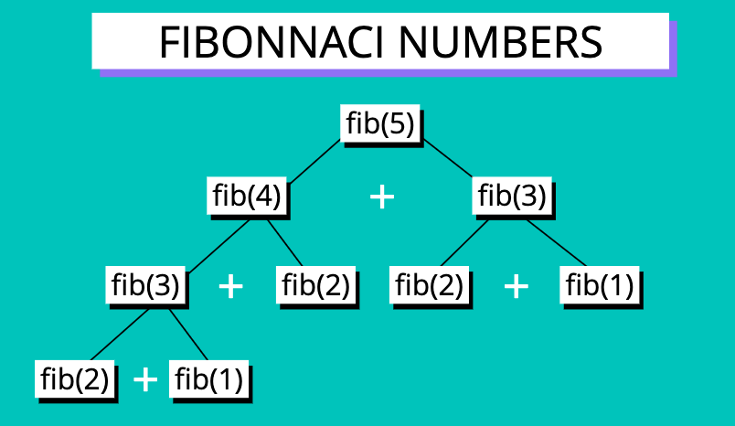

# Dynamic Programming

## Objectives

- Define what dynamic programming is
- Explain what overlapping subproblems are
- Understand what optimal substructure is
- Solve more challenging problems using dynamic programming

## What is Dynamic Programming ?

A method for solving a complex problem by breaking it down into a collection of simpler subproblems, solving each of those subproblems just once, and storing their solutions.

## Where does the name come from ?

Richard Bellman 1950s, millitary army.

## Works on problems with

- Optimal Substructure
- Overlapping Subproblems

### Overlapping Subproblems

A problem is said to have **overlapping subproblems** if it can be broken down into subproblems which are reused several times

#### Example

- Fibonacci Sequence

  Every number after the first two is the sum of the two preceding ones



> For example _mergesort_, involves subproblems but they do not overlap

### Optimal Substructure

A problem is said to have **optimal substructure** if an optimal solution can be constructed from optimal solutions of it's subproblems

## Fibonnaci

### Recursion

```javascript
function fib(n) {
  if (n <= 2) return 1;
  return fib(n - 1) + fib(n - 2);
}
```

#### Big O

O(2<sup>n</sup>)

### Dynamic Programming

#### Memoization (Top - Down)

Storing results of expensive function calls and returning the cached result when the same inputs occur again

```javascript
function fib(n, memo = []) {
  if (memo[n] !== undefined) return memo[n];
  if (n <= 2) return 1;
  const res = fib(n - 1, memo) + fib(n - 2, memo);
  memo[n] = res;
  return res;
}
```

#### Big O

O(n)

### Tabulation (Bottom - Up)

Storing the result of a previous result in a "table" (usually an array)

Usually done using **iteration**

Better **space complexity** can be achieved using tabulation

```javascript
function fib(n) {
  if (n <= 2) return 1;
  const fibNums = [0, 1, 1];
  for (let i = 3; i <= n; i++) {
    fibNums[i] = fibNums[i - 1] + fibNums[i - 2];
  }
  return fibNums[n];
}
```

#### Big O

O(n)

> Space complexity of memoization is worse than tabulation
